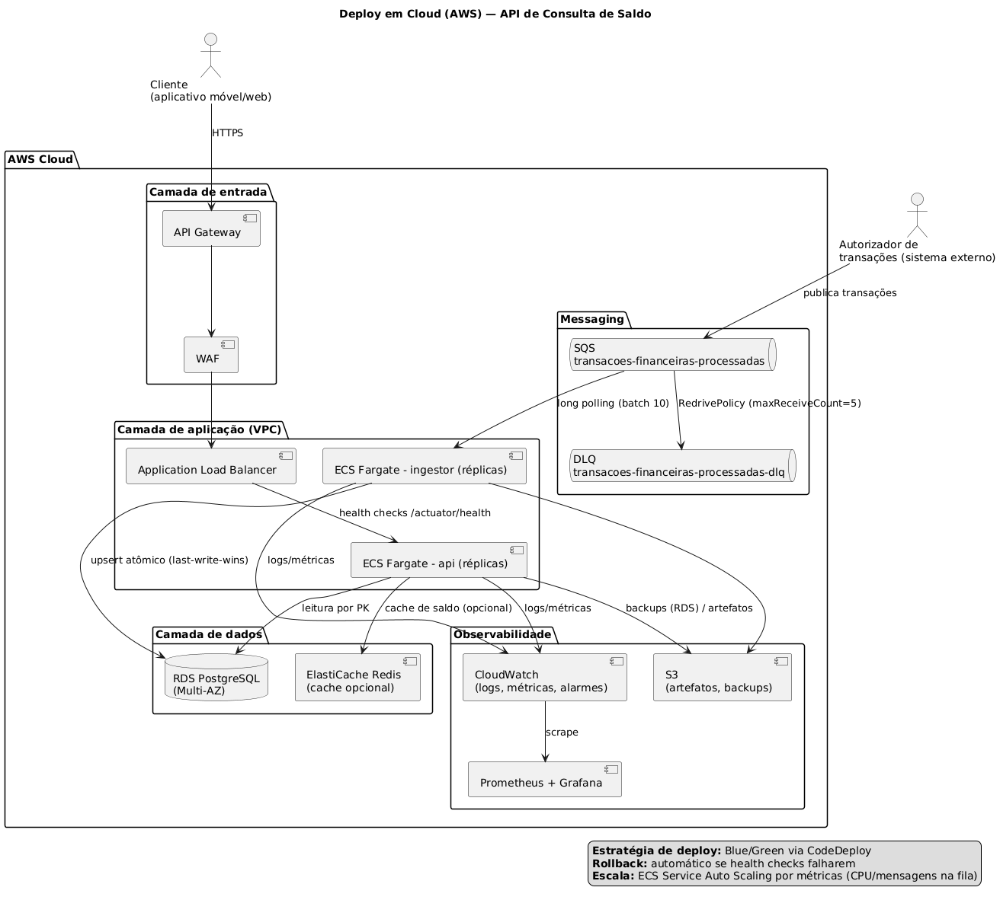

# 🏦 Desafio Técnico Itaú Unibanco — API de Consulta de Saldo

> Solução para o desafio técnico de Engenheiro de Software (Itaú Unibanco):
> **ingestão** de transações financeiras via **AWS SQS** e **exposição** do
> saldo mais atual de uma conta via **REST**.
>
> Foco em **escalabilidade**, **resiliência**, **consistência** e **disponibilidade**.

---

## 📌 Visão Geral

O sistema é composto por dois microsserviços independentes e stateless:

| Serviço | Papel | Porta |
|---|---|---|
| **ingestor** | Consome mensagens da fila SQS, aplica idempotência e atualiza saldos no PostgreSQL (last-write-wins por timestamp) | 8082 (health) |
| **api** | Expõe `GET /api/v1/balances/{accountId}` retornando o saldo mais atual | 8080 |

Um `message-generator` (fornecido pelo desafio) publica **300.000 transações
sintéticas** para **10.000 contas** na fila do Localstack.

### Arquitetura em uma página

```
                 publica                    long polling (batch 10)
Autorizador ───────────►  SQS  ◄────────────  ingestor  ──►  PostgreSQL
                          │  │                 (idempotência +          ▲
                          │  └─► DLQ (após      upsert atômico)         │ leitura
                          │      maxReceiveCount)                       │ por PK
                          │                                             │
                         cliente ──► API Gateway ──► ALB ──► api (REST) ┘
```

## 🚀 Tecnologias

| Tecnologia | Versão | Uso |
|---|---|---|
| Java | 21 | Linguagem (records, switch, text blocks) |
| Spring Boot | 3.2.5 | Framework |
| Spring Data JPA | — | Acesso ao PostgreSQL |
| PostgreSQL | 15 | Banco relacional (ACID) |
| Flyway | — | Migrações (módulo `db-migrations`) |
| AWS SDK v2 | 2.25.0 | Cliente SQS |
| Resilience4j | 2.2.0 | Retry, backoff exponencial, circuit breaker |
| Testcontainers | 1.19.7 | Testes de integração (PostgreSQL + Localstack) |
| Micrometer + Prometheus | — | Métricas (`/actuator/prometheus`) |
| Springdoc/OpenAPI | 2.5.0 | Documentação (Swagger UI) |
| Docker / docker-compose | — | Ambiente local completo |

## 📂 Estrutura do Projeto

```
desafio-itau/
├── pom.xml                     # Pai (multi-módulo)
├── docker-compose.yml          # Localstack + generator + PostgreSQL + ingestor + api
├── requests.http               # Coleção de requisições (IntelliJ/VSCode/Postman)
├── db-migrations/              # Migrações Flyway compartilhadas (schema = contrato)
├── ingestor/                   # Consumo SQS + atualização de saldos
│   ├── Dockerfile
│   └── src/main/java/com/itau/ingestor/
│       ├── config/             # SQS, agendamento
│       ├── consumer/           # Scheduler, pipeline de consumo, decoder, queue URL
│       ├── message/            # Payload da SQS (Java records)
│       ├── persistence/        # Entidades + repositórios (upsert atômico)
│       └── service/            # Regra de negócio, métricas, conversão de timestamp
├── api/                        # Exposição REST
│   ├── Dockerfile
│   └── src/main/java/com/itau/api/
│       ├── controller/         # GET /api/v1/balances/{accountId}
│       ├── service/            # Caso de uso de consulta
│       ├── dto/                # BalanceResponse, ErrorResponse (records)
│       ├── exception/          # Tratamento global de erros
│       ├── model/ + repository/
│       └── config/             # OpenAPI, timezone
├── docs/
│   ├── adr/                    # Decisões arquiteturais (001–004)
│   └── diagrama-cloud.puml     # Diagrama de deploy em cloud
├── scripts/create-queue.sh     # Cria fila + DLQ (RedrivePolicy)
└── .github/workflows/ci-cd.yml # Pipeline CI/CD (Blue/Green proposto)
```

## ⚙️ Pré-requisitos

- **Docker Desktop** (obrigatório — ambiente local com Localstack/Postgres)
- **Java 21** (Temurin)
- **Maven 3.9+**
- **AWS CLI** (opcional — inspecionar a fila)
- **Git**

## 🐳 Executando o Ambiente (tudo de uma vez)

```bash
docker compose up --build -d
```

Isso sobe: Localstack → message-generator (300k transações, one-shot) →
PostgreSQL → **ingestor** (consome tudo automaticamente) → **api**.

> ⚠️ Aguarde o log `message-generator exited with code 0` (fila populada).
> O ingestor começa a consumir em ~5s e atualiza os saldos.

### Execução manual (opcional)

```bash
# 1. Infraestrutura
docker compose up -d localstack postgres message-generator

# 2. Ingestor
cd ingestor && mvn spring-boot:run        # consome a fila

# 3. API (outro terminal)
cd api && mvn spring-boot:run             # http://localhost:8080
```

## 4. TESTANDO A API

### 4.1 Pegue um accountId real

Via SQS (aws cli):

```bash
export AWS_DEFAULT_REGION=sa-east-1 AWS_ACCESS_KEY_ID=test AWS_SECRET_ACCESS_KEY=test
aws --endpoint-url http://localhost:4566 sqs receive-message \
    --queue-url http://localhost:4566/000000000000/transacoes-financeiras-processadas \
    --max-number-of-messages 1
```

→ anote o "account": { "id": "...uuid..." } da mensagem.

Ou direto no banco:

```bash
docker exec -it postgres psql -U admin -d saldo_db -c \
  "SELECT account_id, amount, updated_at FROM balances ORDER BY updated_at DESC LIMIT 5;"
```

### 4.2 curl (qualquer terminal)

```bash
# 200 — saldo encontrado
curl http://localhost:8080/api/v1/balances/<COLE_AQUI_O_UUID>

# 404 — conta inexistente
curl http://localhost:8080/api/v1/balances/00000000-0000-0000-0000-000000000001

# 400 — UUID inválido
curl http://localhost:8080/api/v1/balances/nao-e-um-uuid
```

Resposta esperada (200):

```json
{
  "id": "5b19c8b6-0cc4-4c72-a989-0c2ee15fa975",
  "owner": "315e3cfe-f4af-4cd2-b298-a449e614349a",
  "balance": { "amount": 183.12, "currency": "BRL" },
  "updated_at": "2025-07-05T18:04:13.433-03:00"
}
```

### 4.3 VSCode (extensão REST Client)

- Instale a extensão REST Client (marketplace).
- Abra o arquivo requests.http (raiz do projeto).
- Clique em "Send Request" (o link azul acima de cada requisição).
- Edite o UUID do primeiro GET para um accountId real da seção 4.1.

### 4.4 Postman

- Import → Raw text e cole o comando curl da seção 4.2 (o Postman converte automaticamente em requisição).
- Ou crie manualmente: GET http://localhost:8080/api/v1/balances/{accountId}, aba Headers: Accept: application/json.

### 4.5 Swagger UI (documentação interativa)

Abra no navegador: http://localhost:8080/swagger-ui.html → expanda o endpoint GET /api/v1/balances/{accountId} → Try it out.

### 4.6 Health checks e métricas

| URL | O que mostra |
|---|---|
| http://localhost:8080/actuator/health | API saudável? ("status":"UP") |
| http://localhost:8082/actuator/health | Ingestor saudável? |
| http://localhost:8080/actuator/prometheus | métricas (ingestor_messages_applied_total etc.) |

## 5. VERIFICANDO NO BANCO (opcional)

```bash
docker exec -it postgres psql -U admin -d saldo_db
```

```sql
-- quantas contas já têm saldo?
SELECT count(*) FROM balances;

-- as 10 atualizações mais recentes
SELECT account_id, amount, updated_at FROM balances ORDER BY updated_at DESC LIMIT 10;

-- idempotência: quantas transações já processadas
SELECT count(*) FROM processed_transactions;
```

## 6. RODANDO OS TESTES

```bash
cd "/desafio-saldo"

# Testes unitários (rápidos, sem Docker)
mvn test -Dgroups=unit

# Testes de integração (Testcontainers — PRECISA do Docker rodando)
mvn test -Dgroups=integration
```

## 🔍 Testando a API (resumo)

```bash
curl http://localhost:8080/api/v1/balances/5b19c8b6-0cc4-4c72-a989-0c2ee15fa975
```

Resposta (contrato idêntico ao enunciado — `updated_at`):

```json
{
  "id": "5b19c8b6-0cc4-4c72-a989-0c2ee15fa975",
  "owner": "315e3cfe-f4af-4cd2-b298-a449e614349a",
  "balance": {
    "amount": 183.12,
    "currency": "BRL"
  },
  "updated_at": "2025-07-05T18:04:13.433-03:00"
}
```

| Status | Cenário |
|---|---|
| `200` | saldo encontrado |
| `400` | `accountId` não é UUID válido |
| `404` | conta não encontrada |

- **Swagger UI:** http://localhost:8080/swagger-ui.html
- **Health check api:** http://localhost:8080/actuator/health
- **Health check ingestor:** http://localhost:8082/actuator/health
- **Métricas:** http://localhost:8080/actuator/prometheus
- **Coleção de requisições:** `requests.http`

Inspecionar a fila (AWS CLI):

```bash
export AWS_DEFAULT_REGION=sa-east-1 AWS_ACCESS_KEY_ID=test AWS_SECRET_ACCESS_KEY=test
aws --endpoint-url http://localhost:4566 --region sa-east-1 sqs receive-message \
    --queue-url http://localhost:4566/000000000000/transacoes-financeiras-processadas \
    --max-number-of-messages 10
```

## 🧪 Testes

| Camada | Comando | O que valida |
|---|---|---|
| Unitários | `mvn test -Dgroups=unit` | Timestamp (micros), decoder do payload, `BalanceService` (mocks) |
| Integração | `mvn test -Dgroups=integration` | Fluxo SQS→ingestor→Postgres (Testcontainers), idempotência, fora de ordem, REJECTED, API 200/400/404 |

**Pré-requisito (integração): Docker rodando.** Em macOS com Docker Desktop,
caso o socket não seja encontrado:

```bash
export DOCKER_HOST=unix:///var/run/docker.sock
```

A separação por tags (`@Tag("unit")` / `@Tag("integration")`) segue a
**pirâmide de testes**: muitos testes rápidos e baratos + poucos testes de
integração reais — e roda separadamente na CI.

## 📊 Decisões Arquiteturais (ADRs)

| ADR | Tema |
|---|---|
| [001-banco-de-dados.md](docs/adr/001-banco-de-dados.md) | Por que PostgreSQL (ACID/CAP) e por que não NoSQL |
| [002-ingestor.md](docs/adr/002-ingestor.md) | Polling, idempotência, upsert atômico (last-write-wins), DLQ |
| [003-api.md](docs/adr/003-api.md) | Contrato REST (snake_case), erros padronizados, timezone |
| [004-deploy-e-observabilidade.md](docs/adr/004-deploy-e-observabilidade.md) | Blue/Green, health checks, métricas |

## ☁️ Diagrama de Deploy em Cloud



> Fonte editável: [`docs/diagrama-cloud.puml`](docs/diagrama-cloud.puml)
> (renderize com PlantUML/VS Code para alterações).

Componentes AWS propostos: **API Gateway** (entrada, auth/rate limit) →
**WAF** → **ALB** → **ECS Fargate** (api e ingestor) → **RDS PostgreSQL
Multi-AZ** + **ElastiCache** (cache opcional). Observabilidade com
**CloudWatch** + **Prometheus/Grafana** e **S3** para artefatos/backups.

## 🔄 Pipeline CI/CD (Blue/Green)

[`.github/workflows/ci-cd.yml`](.github/workflows/ci-cd.yml) — no push para
`main`: `build` → `unit-tests` → `integration-tests` (Docker nativo do runner)
→ `deploy` (proposta): imagem no ECR + CodeDeploy Blue/Green com tráfego
gradual e **rollback automático** se os health checks falharem.

## ✅ Padrões e Boas Práticas Aplicados

| Prática | Onde |
|---|---|
| Stateless, escalável horizontalmente | ambos os serviços |
| Idempotência (at-least-once do SQS) | `processed_transactions` + `ON CONFLICT` |
| Last-write-wins por timestamp (fora de ordem) | upsert atômico com `WHERE updated_at < ...` |
| Resiliência (retry, backoff, circuit breaker) | Resilience4j no pipeline de consumo |
| Arquitetura em camadas (adapters + serviço) | `consumer/*`, `service/*`, `persistence/*` |
| DTOs imutáveis (Java records) | `message/`, `dto/` |
| Erros padronizados (400/404/500) | `@RestControllerAdvice` |
| Config por ambiente (12-factor) | `application.yml` + env vars no compose |
| Observabilidade | Actuator + métricas Prometheus + logs com `txId`/`msgId` |
| Testes (pirâmide) | unit (tags) + integração (Testcontainers) |
| Migrações versionadas | Flyway (módulo compartilhado) |
| Containerização multi-stage | `Dockerfile` por serviço |

## 🚧 Melhorias Futuras (Roadmap)

| Melhoria | Motivação |
|---|---|
| Cache Redis no saldo | Reduzir latência em leitura pesada |
| Réplicas de leitura | Separar consulta da API do banco de escrita |
| Autenticação/autorização na API | Proteger endpoints em produção |
| Arquivo (retention) de `processed_transactions` | Evitar crescimento infinito |
| Deploy real Blue/Green + canary | Automatizar com conta AWS |
| SQS FIFO | Ordenação estrita (se requisito futuro exigir) |

## 👨‍💻 Como Contribuir

1. Faça um fork;
2. Crie uma branch: `git checkout -b feature/nova-feature`;
3. Commit: `git commit -m 'Adiciona nova feature'`;
4. Push e abra um Pull Request.

## 📄 Licença

Projeto desenvolvido exclusivamente para fins do desafio técnico do Itaú Unibanco.
